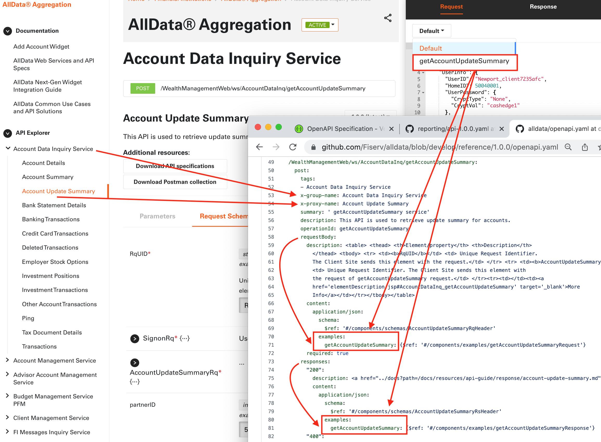

# Enable Sandbox

We offer two ways to test services defined by OpenAPI specification in Developer Studio. One way is to connect tenant openAPI spec to tenan sandbox. The other way to test an endpoint is to setup a mock server. We use [Stoplight Prism](https://meta.stoplight.io/docs/prism/ZG9jOjYx-overview) Mock server.

## Tenant Sandbox

Developer Studio is able to connect to tenant Sandbox. The connection requirements depend on authentication scheme used by the tenant.

As an exapmle for [HMAC](https://en.wikipedia.org/wiki/HMAC) authentication scheme, Developer Studio would need:

    serverUrl:"https://base-url-to-be-pre-pended-to-an-endpoint"
    authenticationScheme:"HMAC"
    apiKey:"2MWVAWF2xZz0eNQUK0NVhwpWYkr7gehG"
    secret:"some secret"
    selfSignedCert:false

## Stoplight Prism Mock Server

There are couple of steps to follow for the prism mock server to work.
 
1. Add example request and response in your openapi spec file so that prism **mock** server can validate your request payload and then return the correct **mock** response depending on that example. Example name in request & response must be the same and unique. There could be multiple examples. 

 Below is a sample of how to add examples in your spec file and how examples gets mapped on Developer Studio UI.

    
 
 
2. To install and run Stoplight Prism locally refere to the following command 

  `npm install -g @stoplight/prism-cli`

3. We encorrage to test the openAPI spec locally before pushing the changes to GitHub

  `prism mock <your yaml file name>`
 
4. Finally once you are done updating the spec files please let us know we would need to setup up an actual mock server.

5. To enable the Run Button, product sandbox & feature sandbox has to be set in **config/tenant.json** file:

             "sandbox": "/v1/sandboxrun/<tenant name>",
             "feature":[
              {
                "name": "sandBox",
                "value": true
              },
